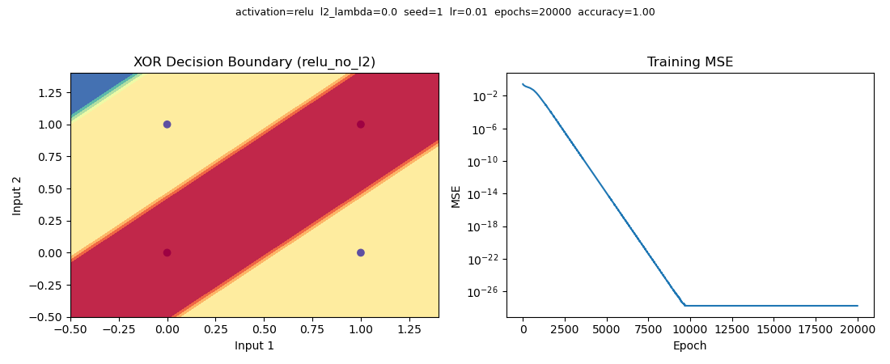
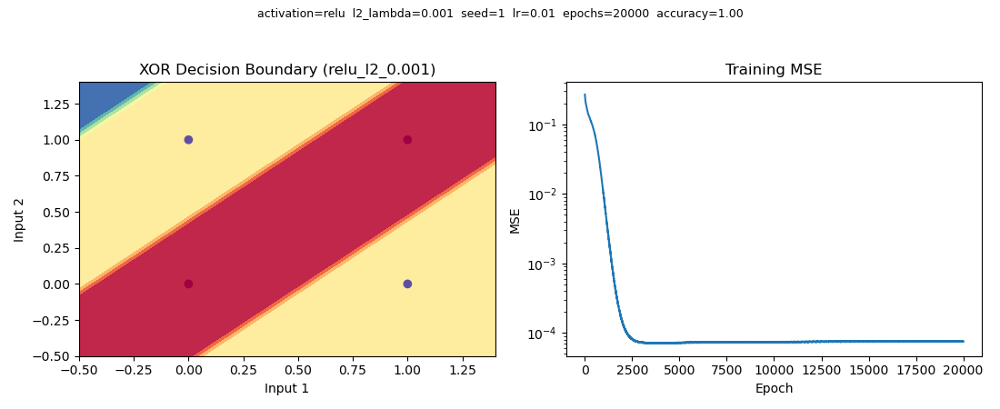
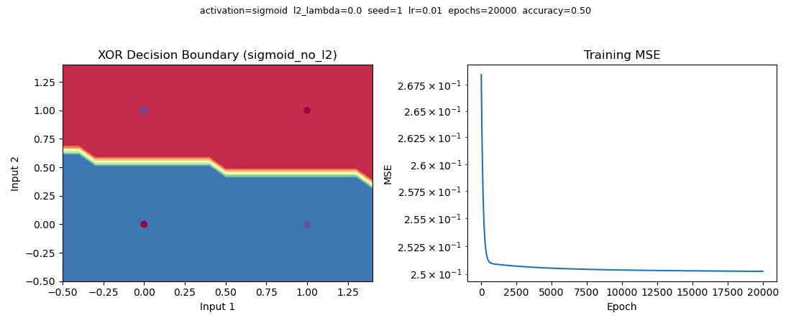

# XOR MLP (step by step, NumPy only)

NumPy のみで実装した、教育用の多層パーセプトロン(MLP)です。XOR 問題を題材に、 `Neuron` → `Layer` → `NeuralNetwork`
という素朴な階層構造でフォワード/バックプロパゲーションを実装しています。 重みの L2 正則化(weight
decay)を有効/無効にして、収束性の違いを比較できるようになっています。

## 1. 使い方 (Usage)

```bash
# 依存パッケージ
pip install numpy matplotlib

# L2 正則化なしで学習
python3 main.py --seed 1

# L2 正則化ありで学習(強さは --l2-lambda で指定)
python3 main.py --seed 1 --l2 --l2-lambda 0.001
```

主なコマンドライン引数:

| 引数 | 説明 | デフォルト |
| --- | --- | --- |
| `--activation` | 活性化関数(`relu` / `sigmoid`) | `relu` |
| `--l2` | L2 正則化(weight decay)を有効化するフラグ | 無効 |
| `--l2-lambda` | L2 正則化の強さ(`--l2` 指定時のみ有効) | `0.001` |
| `--epochs` | 学習エポック数 | `50000` |
| `--learning-rate` | 学習率 | `0.01` |
| `--seed` | 重み初期化の乱数シード | `0` |

`--l2` の有無で結果を比較する際は、**同じ `--seed` を指定**してください。初期重みを揃えないと、 収束性の違いが L2
の効果なのか初期値の偶然なのか区別できません。

実行すると、標準出力に学習経過(MSE)・予測結果・学習後の重みが表示され、 `xor_result_<run_name>.png` という画像ファイル(決定境界 +
学習曲線)が保存されます。 ファイル名は活性化関数と L2 の設定ごとに変わる(例: `relu_no_l2` / `sigmoid_l2_0.001`)ので、
複数回実行しても上書きされません。画像の上部には `activation` / `l2_lambda` / `seed` / `lr`(学習率) / `epochs` /
`accuracy`(精度)が併記されるので、パラメータと結果を画像単体で追跡できます。

## 2. 実行結果のサンプル

`--seed 1 --epochs 20000` で実行した例です。

### ReLU, L2 正則化なし (`--seed 1`)



### ReLU, L2 正則化あり (`--seed 1 --l2 --l2-lambda 0.001`)



左が決定境界、右が学習曲線(MSE, 対数軸)です。このシードでは両方とも Accuracy 1.0 に到達しますが、 L2
ありの方は重みの絶対値が抑えられる分、決定境界の遷移がよりなだらかになり、収束後の MSE もわずかに 大きくなります(重みをゼロに近づけようとする力とのトレードオフ)。

> **XOR は収束性が悪いネットワークです。** 隠れ層のニューロン数が少ない(`[2, 2, 1]`)上に 活性化関数が ReLU
> のため、初期値によっては一部のニューロンが「死んで」(常に出力 0)しまい、 学習が進まないまま Accuracy 0.5〜0.75
> で頭打ちになることがあります。`--l2-lambda` を大きくしすぎる (例: `0.05`)と、この dying ReLU が悪化してほぼ全ての重みが 0
> に潰れてしまう現象も観察できます。 これも含めて実験対象と捉えてください。

### 参考: Sigmoid (`--seed 1 --activation sigmoid`)



同じ `--seed 1` でも、活性化関数を Sigmoid に変えると学習率 `0.01` / 20000 エポックでは Accuracy 0.5
で停滞します(勾配消失により学習がほぼ進みません)。ReLU との比較を通じて、 活性化関数の選択が収束性に与える影響も確認できます。

## 3. 各コードの解説

### [`neuron.py`](neuron.py) — `Neuron`

最小単位のニューロン。1 個のニューロンが持つ重み・バイアスと、活性化/逆伝播の計算を担当します。

- `__init__`: 重みは単純な標準正規分布 `N(0, 1)` で初期化します(He/Xavier 初期化は不採用。理由は
  [5. 補足: 重み初期化(He/Xavier)について](#5-補足-重み初期化heXavierについて) を参照)。
  `rng`(`np.random.Generator`)を外部から注入できるようにしており、`NeuralNetwork` にシードを渡すことで
  再現性のある比較ができます。
- `activate`: 入力の重み付き和(`self.sum`)を計算し、`self.activation` に応じて ReLU または Sigmoid を
  適用した出力を返す。逆伝播で使うため `self.inputs` / `self.sum` / `self.output` を保持しておく。
- `activation_derivative`: 現在の活性化関数に対応する導関数(`relu_derivative` / `sigmoid_derivative`)を
  返す。`Layer.backward` はこれを呼ぶだけで、活性化関数の違いを意識しなくてよい設計にしています。
- `relu` / `relu_derivative` / `sigmoid` / `sigmoid_derivative`: 各活性化関数とその導関数の実装。
- `update_weights`: 誤差項(`delta * self.inputs`)による勾配降下ステップに加えて、L2 weight decay
  (`- l2_lambda * self.weights`)を適用します。バイアスは正則化の対象外です。

### [`layer.py`](layer.py) — `Layer`

同じ層に属する `Neuron` をまとめて扱うクラス。

- `forward`: 各ニューロンの `activate` を呼び出し、層の出力ベクトルを返す。
- `backward`: 出力側から伝わってきた誤差(`errors`)をもとに各ニューロンのデルタを計算し、 `update_weights` で重みを更新。同時に、1
  つ前の層に伝える誤差(重みの転置 × デルタ)を計算して返す — これが誤差逆伝播法の核となる処理です。
- `weights`: 各ニューロンの `(weights, bias)` タプルのリストを返す(デバッグ・結果確認用)。

### [`neuralnetwork.py`](neuralnetwork.py) — `NeuralNetwork`

複数の `Layer` を束ねて、学習・推論のループを管理するクラス。

- `__init__`: `layers`(各層のユニット数のリスト、例 `[2, 2, 1]`)から `Layer` を構築。 `seed` から作った
  `np.random.Generator` を全層で共有することで、重み初期化を再現可能にしています。 `l2_lambda` はここで保持し、`train` 内の
  `backward` 呼び出しに渡されます。
- `train`: 各エポックで全サンプルに対してフォワード→誤差計算→バックワードを実行し、MSE を `loss_history` に記録します(学習曲線の描画に使用)。
- `predict`: 学習済みの重みで推論のみを行う(フォワードパスのみ)。
- `weights`: 全層の重みをまとめて取得。

### [`main.py`](main.py)

学習の実行スクリプト。`argparse` で活性化関数(`--activation`)や L2 のオン/オフ、各種ハイパーパラメータを
コマンドライン引数から指定できるようにし、`NeuralNetwork` を構築・学習させた上で、決定境界と学習曲線 (MSE)を 1 つの図にまとめて
`xor_result_<run_name>.png` に保存します。図の上部には使用した `activation` / `l2_lambda` / `seed` / `lr`
/ `epochs` / `accuracy` を併記し、画像だけで実行条件と 結果が分かるようにしています。

## 5. 補足: 重み初期化(He/Xavier)について

ディープラーニングの教科書的な初期化手法として、ReLU 向けの **He 初期化** (`scale = sqrt(2 / fan_in)`)や、Sigmoid/tanh
向けの **Xavier(Glorot)初期化**
(`scale = sqrt(1 / fan_in)`)がよく紹介されます。目的は、層を経るごとに活性化前の値(重み付き和)の
分散が発散したり消失したりしないよう、重みのスケールを入力数(fan-in)に応じて調整することです。

このリポジトリでは検証の結果、**あえて採用していません**。理由は**このネットワーク構成では効果が出ない**ためです。 `main.py` のデフォルト構成
`[2, 2, 1]` は、 どの層も fan-in が 2 です。He 初期化のスケールは `sqrt(2/2) = 1.0` となり、 単純な標準正規分布
`N(0, 1)`(スケール 1)と数式上完全に一致してしまいます。 つまり、このネットワークで He 初期化を実装しても、単純な初期化と全く同じ結果にしかなりません。

`neuron.py` の重み初期化は常に単純な `N(0, 1)` としています。He/Xavier 初期化を試したい場合は、`Neuron.__init__` の
`self.weights = rng.normal(size=num_inputs)` の行を
`self.weights = rng.normal(scale=(2 / num_inputs) ** 0.5, size=num_inputs)`(He、ReLU 向け)や
`self.weights = rng.normal(scale=(1 / num_inputs) ** 0.5, size=num_inputs)`(Xavier、Sigmoid
向け) に差し替えることで再現できます。
